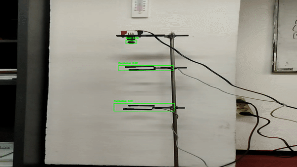

# Freely Falling Object Calculation using YOLOv3 Algorithm

This repository contains the implementation of the YOLOv3 algorithm for the calculation of freely falling object movements. The steps involved in the process are outlined below:

## Steps

1. **Training Model using Darknet Framework**
   - Train the YOLOv3 model using the Darknet framework developed by Joseph Redmon.
   - Utilize the provided pre-trained model for the base architecture.

2. **YOLOv3 Architecture Overview**
   - Include an illustration and explanation of the YOLOv3 architecture used in the project.
   

3. **Loss Function**
   - Provide details about the employed loss function used during the model training phase.
   

4. **Mean Average Precision (mAP)**
   - Include information about the mAP evaluation metric and its significance in assessing the model's accuracy.
    

5. **Object Tracking Results**
   - Present the outcomes of object tracking, focusing on the detected ball and sensors.
   - Discuss the significance of accurately detecting these components for the subsequent calculations.
    
    
    

6. **Time Measurement Results**
   - Display the recorded time measurements for the falling object using the detected sensor positions.
   - Explain the methodology and implications of these time measurements.
    

7. **Acceleration Calculation Results**
   - Showcase the calculated acceleration values based on the obtained time measurements.
   - Discuss the comparison between the YOLOv3-based results and sensor-based measurements.
    

## Important Notes

- For accurate results, ensure the YOLOv3 model effectively detects both the falling object (ball) and the sensors.
- The architecture of YOLOv3, along with its training and loss function details, play a pivotal role in obtaining reliable outcomes.
- The object tracking results should demonstrate the capability of the model to precisely locate the falling object and sensors.
- The calculated time measurements serve as the foundation for determining the acceleration due to gravity.
- Comparative analysis between YOLOv3-based measurements and sensor-based measurements offers insights into the model's accuracy.

Feel free to explore the repository and refer to the attached files for detailed information about each step and the corresponding results.

## License

This project is licensed under the [MIT License](LICENSE).